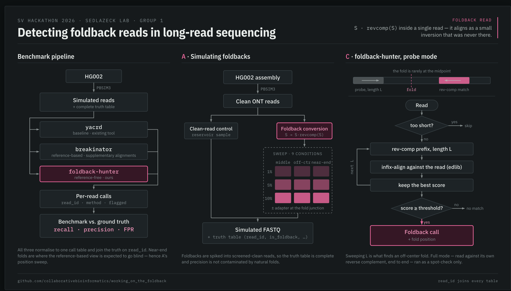

# Foldback Hunters
### Detecting Foldback Reads in Long-Read Sequencing

Presentation: https://docs.google.com/presentation/d/1WeAZOY6bWZYZP9_VU5Mh9rwYj5OVDrnPBxRT1ltQKd4/edit?slide=id.g3f89997e881_0_139#slide=id.g3f89997e881_0_139

## Background
A foldback read is a single sequencing read whose second half is the reverse complement of its first half. This arises in Oxford Nanopore sequencing when a single-stranded molecule folds back on itself during library preparation, or when template and complement strands pass through the pore together without being split by the basecaller. When aligned to a reference, such a read produces a supplementary alignment to the same locus in opposite orientation at adjacent coordinates, which structural variant callers can interpret as a small inversion that is not real.
This artifact is documented in recent literature. Heinz, Meyerson, and Li (2025) [1] released Breakinator, an alignment-based detector that flags reads with the supplementary-in-opposite-orientation signature within 200 bp of the alignment end and a 10 percent margin around the read midpoint, and benchmarked it across ONT and PacBio chemistries. SAVANA [2] already includes a foldback-preprocessing step in its somatic SV pipeline and reports rates of 1 to 4 percent of gDNA reads across tumor regions and patients, reaching 20 to 30 percent in some cases. Severus [3] and Sniffles2 [4] address the downstream consequences differently: Sniffles2 filters all low-frequency inversions under 1 kb, which removes the artifacts but also discards any real inversion in that size class. On the vendor side, an open GitHub issue on Dorado documents that the basecaller does not split sequence-only foldbacks (those without a clean internal adapter), so they pass unchanged into downstream analysis.


## Usage

### Environment

Conda (recommended):
```bash
conda env create -f environment.yml
conda activate foldback-detector
```

(Or alternatively) Pip only:
```bash
python -m venv .venv
source .venv/bin/activate
pip install -r requirements.txt
```

### Quickstart

Run the read-level detector on a FASTQ:
```bash
python detectors/read_level_detector.py --fastq sim/sim_middle.fastq --outdir results/
```

This writes two TSVs to `results/` (see [schema.md](schema.md)):
* `calls_foldback_hunter_<stem>.tsv` — `read_id, method, flagged`
* `scores_foldback_hunter_<stem>.tsv` — `read_id, raw_score, fold_position_bp, status`

`<stem>` is the fastq filename stem, e.g. `foo.fastq.gz` -> `foo`.

### Options

| Flag | Default | Meaning |
|---|---|---|
| `--fastq` | *(required)* | Input FASTQ, plain or `.gz`. |
| `--outdir` | `results` | Output directory (created if missing). |
| `--mode` | `probe` | Scoring mode: `probe` (fast edlib infix search), `full` (parasail Smith-Waterman, slow — needs `--max-reads`), or `seed` (k-mer seed + bounded edlib, good middle ground). |
| `--processes` | `None` | Number of worker processes for parallel scoring. |
| `--max-reads` | `None` | Cap reads scored; required when `--mode full`. |

### Example

```bash
python detectors/read_level_detector.py \
  --fastq data/sim_near_end.fastq.gz \
  --mode seed --processes 8 \
  --outdir results/
```
```
[foldback_hunter] 50000 reads scored, mode=seed
[foldback_hunter] wrote results/calls_foldback_hunter_near_end.tsv
[foldback_hunter] wrote results/scores_foldback_hunter_near_end.tsv
```


## Two Ways to Detect a Foldback
The same foldback can be detected from two different inputs, and the two approaches fail in different places. That difference is the scientific content of the project.

* **Read-level (reference-free):** Look at the read sequence alone. A foldback read is self-complementary, so aligning the read against its own reverse complement reveals the fold as a diagonal wherever it occurs. Crucially, the detector must find the fold point rather than assume it sits at the midpoint, because real folds are usually off-center. A midpoint-only version fails on off-center folds and must not be used except as a rough first estimate.
* **Alignment-level (reference-based):** Look at how the read maps after alignment. A foldback produces a supplementary alignment to the same locus in opposite orientation at adjacent coordinates. This detector has a structural blind spot: when the fold is near the read end, the short reverse-complement tail is soft-clipped rather than producing a supplementary alignment, so the foldback is invisible at this level.

A structural variant caller works at the alignment level, so it shares the alignment-level blind spot. Showing that the read-level detector catches foldbacks the alignment-level view misses is the same as showing which artifacts slip past the caller entirely versus which get miscalled as inversions.

## What We Will Do at the Hackathon
The scoping principle: finish a small, self-contained benchmark, then extend if time allows. The whole project uses HG002 and simulated data only; no external truth set is required.

* **Framing A (must finish) — Detection benchmark:** Build the read-level and alignment-level detectors, and benchmark them against existing tools (`yacrd` (Marijon et al. 2020), `duplex-tools`/`Dorado`, Sniffles2 (Smolka et al. 2024) filter behavior) on simulated foldback data with a complete truth table. Report recall, precision, and false positive rate for every method.
* **Framing B (stretch) — The filter-replacement argument:** The current fix removes every low-frequency inversion under 1 kb, so its false positive rate against any real small inversion is total. Show that a detector-based filter removes the same foldback artifacts at a far lower false positive rate on non-foldback reads, so it can replace the blunt size cutoff without discarding small inversions indiscriminately. This is demonstrated on the simulated data and the clean control, with no external truth set.

The real-rate measurement on HG002 is a day-1 must in either framing, and replaces the remembered 5 percent with the team's own number.

## Task Assignments
The group is heterogeneous, so some tasks carry more people. Before any detection code is written, freeze two table schemas in the repo on day-1: 
1. **The truth table:** `(read_id, is_foldback, fold_position, adapter_present, source_locus)`
2. **The per-read call table:** `(read_id, method, flagged)`

Every script reads or writes one of these; if they drift, benchmarking cannot join anything.

### ● Task A: Simulation and real-rate measurement
* Write the self-complementarity scoring function (self-alignment that finds the fold point at any position, using an in-process aligner such as `edlib` or `parasail`, not a per-read `minimap2` call). 
* Run it on a subsampled HG002 ONT set (one BAM or a few hundred thousand reads, not the full dataset) to report the observed foldback rate with a confidence interval. 
* Separately, build a simulator that spikes known foldbacks into a clean source, sweeping foldback fraction (e.g., 1, 5, 10 percent), fold position (middle, quarter, near-end), and adapter presence, and emits FASTQ plus a complete truth table. Use a screened-clean or reference-derived source so the truth table is complete and pre-existing natural foldbacks do not contaminate the precision numbers. 
* **Day 1 Deliverables:** Measured rate, simulated FASTQs, truth table.

### ● Task B: Existing-tool baselines
* Run `yacrd` (expected to miss foldbacks, which have no coverage gap; an informative negative).
* Run `duplex-tools` or `Dorado` internal splitting (expected to catch adapter-bridged folds and miss sequence-only ones, which the adapter-presence axis makes visible).
* Run `minimap2` plus `Sniffles2` with and without its sub-1 kb inversion filter (override the filter using the `--minsvlen` option). 
* Normalize each tool's output to a per-read flag keyed by `read_id`. For `Sniffles2`, map spurious inversion calls back to the foldback reads that caused them; sub-1 kb calls at loci with no foldback reads are the presumptively real inversions the blunt filter discards. 
* **Day 1 Deliverables:** Per-read baseline results for each tool.

### ● Task C: The two custom detectors
* **Read-level detector:** Run the self-alignment scoring function from Task A on the simulated set, emitting a per-read score table (shares its core function with the real-rate script; write that function once as a small module). 
* **Alignment-level detector:** Parse the BAM with `pysam` and flag reads whose primary and supplementary alignments hit the same locus in opposite orientation at adjacent coordinates. The alignment-level detector is expected to miss near-end folds; that miss is a result, not a bug to fix. 
* **Day 1/2 Deliverables:** Read-level scores by Day 1; alignment-level detector by early Day 2.

### ● Task D: Benchmarking and figures
* Join every method's per-read output to the truth table. 
* Compute recall, precision, and false positive rate per method, faceted by fold position and adapter presence (Framing A). 
* Produce the false-positive-rate comparison between the blunt 1 kb filter and the detector-based filter (Framing B). 
* Write the README stating both findings in plain language. 
* **Day 2 Deliverables:** Final figures and README.

## Expected Output
* **Repository (`foldback-bench/`):** Contains `sim/` (Task A), `baselines/` (Task B), `detectors/` (Task C), `analysis/` (Task D), `data/`, `results/`, and a GitHub `README` stating both findings in plain language.
* **Measured rate:** A single number with a confidence interval: the foldback fraction in real HG002 ONT data, stated against the remembered 5 percent. This is the first concrete result the team produces and turns a recollection into evidence.
* **Framing A figure:** One point or bar per method (`yacrd`, `duplex-tools`/`Dorado`, read-level detector, alignment-level detector) on a shared axis. Y-axis is the recall of foldback reads, with false positive rate on the clean control annotated, faceted by adapter presence. 
  * *Expected shape:* `yacrd` near zero; `Dorado` high on adapter-present and low on adapter-absent; read-level detector high across fold positions; alignment-level detector high for middle folds and dropping toward the read end.
* **Framing B result:** A comparison showing the blunt 1 kb filter removes all sub-1 kb inversions (total false positive rate against real small inversions) while the detector-based filter removes the same foldback artifacts at a much lower false positive rate on non-foldback reads. This makes the case for replacing the size cutoff with a detector, using only HG002 and simulated data.

### Future Work (not attempted here)
Extending the same benchmark framework to fusion chimeras (reads joining two different loci, including near-identical viral strains), which need different detectors than the self-complementarity signal used for foldbacks.


## Methods



## Results


## References
* Marijon, Pierre, Rayan Chikhi, and Jean-Stéphane Varré. 2020. “Yacrd and Fpa: Upstream Tools for Long-Read Genome Assembly.” *Bioinformatics* (Oxford, England) 36 (12): 3894–3896.
* Smolka, Moritz, Luis F. Paulin, Christopher M. Grochowski, et al. 2024. “Detection of Mosaic and Population-Level Structural Variants with Sniffles2.” *Nature Biotechnology* 42 (10): 1571–1580.

