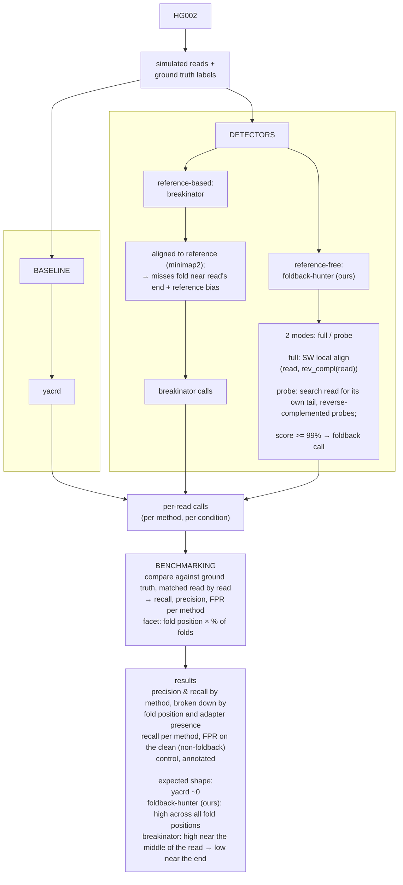
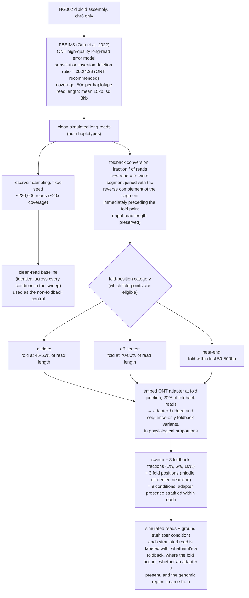
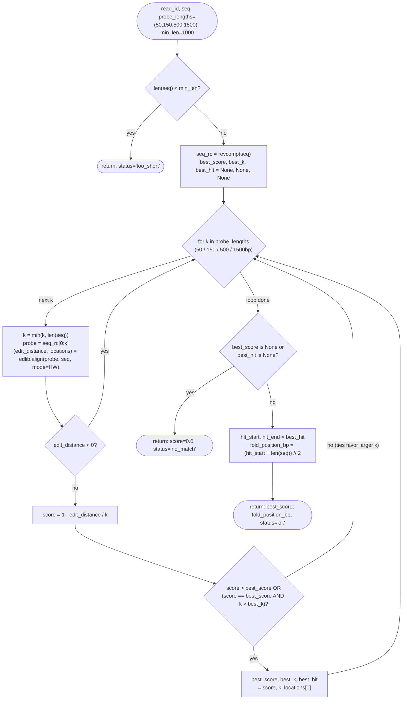
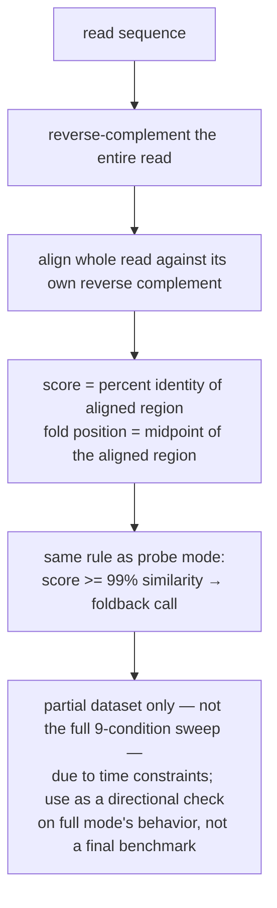

# Methods Overview

Detail diagrams: [A]-detail, [C]-detail (below).

---

# [A]-detail — Simulation of foldback reads

---

# [C]-detail — foldback-hunter (ours): probe mode and full mode

Reference-free, read-level detector: looks for a read's own self-complementarity
instead of aligning to the genome or examining supplementary alignments.
Two modes considered: probe and full.
Probe mode is the primary mode — fully run across the dataset, detailed below.
Full mode was not run on the full dataset (time constraints during the
hackathon); treat its results as a partial spot-check, not a like-for-like
comparison against probe mode's coverage.

## Probe mode (primary)

`foldback_score.py: score_read_probe`

> Note: score >= 99% similarity is applied downstream (benchmarking), not
> inside this function — `raw_score` is written out as-is (schema.md:
> "flagged is the raw float score, not a threshold").

## Full mode

