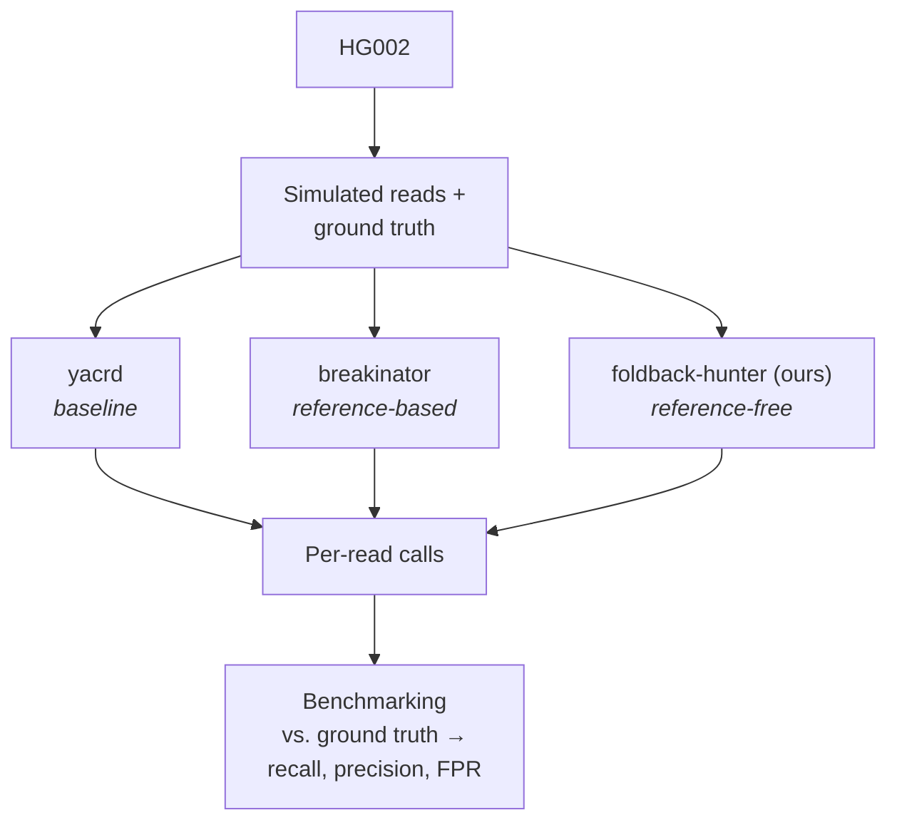
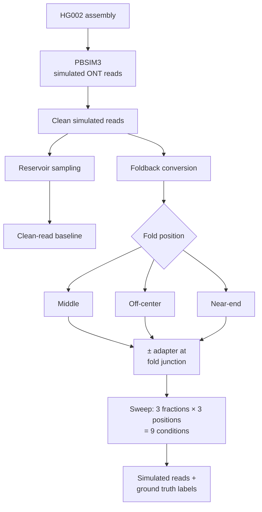
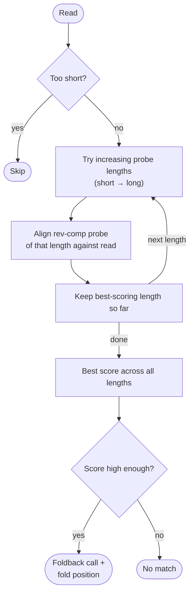
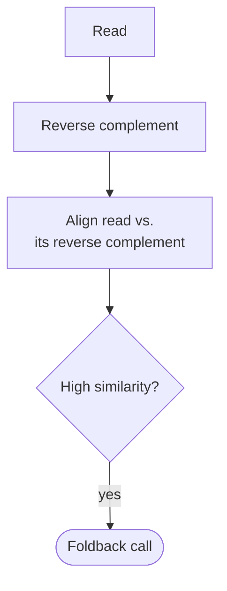

# Methods Overview

Detail diagrams: [A]-detail, [C]-detail (below).

---

# [A]-detail — Simulation of foldback reads

---

# [C]-detail — foldback-hunter (ours)

Reference-free: detects a read's self-complementarity directly, no alignment to genome.
**Probe mode** is primary (ran on full dataset); **full mode** is a partial spot-check only.

## Probe mode

## Full mode

